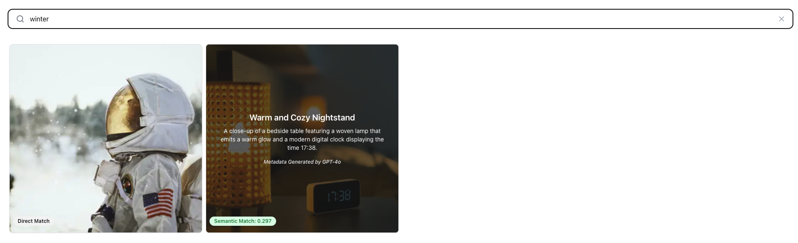

# vision search

The main aim of this project is to implement the semantic vision search engine service.
This repository provides 2 different implementations of the vision search engine service:

1. [web application with full-stack implementation](./frontend)
2. [RESTful API with backend implementation](./backend/)

